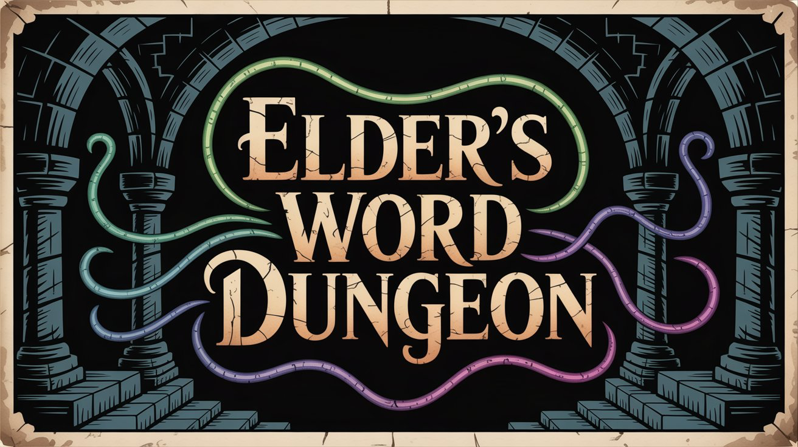
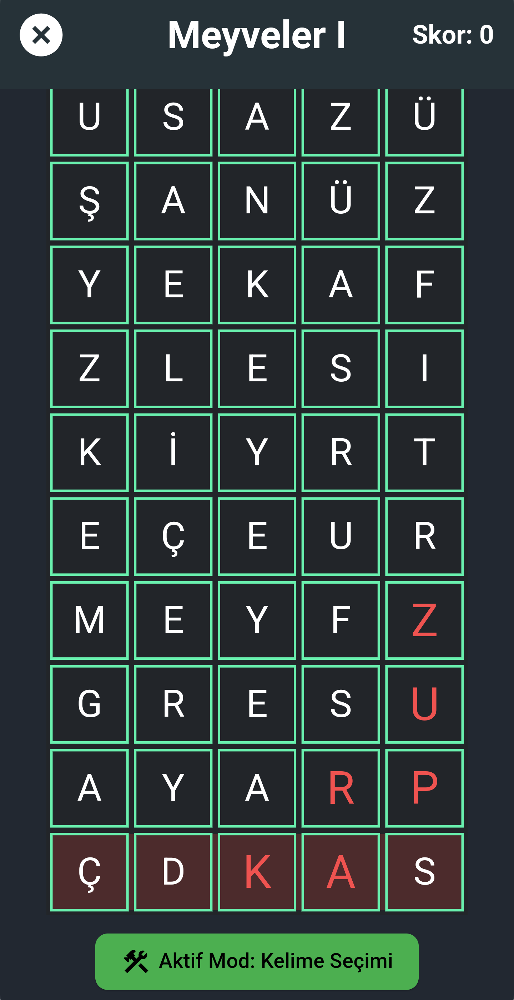

# 🧩 Elder's Word Dungeon (Android Optimized Version)

> A fast, fluid and immersive competitive word puzzle experience — built with Flutter & Flutter Flame.



---

## ⚖️ License & Usage Terms

This project is licensed under the [MIT License](./LICENSE).

> **All rights reserved by Sait Kaplan.**  
> Redistribution and reuse are permitted under the terms of the license, but:
>
> - ❌ You may **not claim authorship** of this work.
> - ❌ You may **not remove license or credit notices**.
> - ❌ You may **not use it for commercial purposes** without permission.
>
> ✅ Respect the license and **credit the original author**.

---

## 🚀 Overview

**Elder's Word Dungeon** is a **competitive word puzzle game** that blends quick thinking and vocabulary mastery.

This repository contains the **Android-optimized version**.  
It is designed to run smoothly on a wide range of Android devices, offering:

- 🧠 **Unique and hard word challenges**
- 🎮 **Competitive real-time ranking system**
- 🇹🇷 **Focus on Turkish vocabulary**
- 📱 **Platform-specific performance enhancements**

---

## 🖼️ Screenshots

<p float="left">
  
  
  
</p>

---

## 🛠️ Setup and Running (Android)

Follow these steps to set up and run this project on your local machine:

1.  **Prerequisites:**
    * [Flutter SDK](https://docs.flutter.dev/get-started/install) (Stable channel, recommended version: 3.22.3)
    * [Android Studio](https://developer.android.com/studio) or [VS Code](https://code.visualstudio.com/) installed.
    * An Android emulator or physical device (with USB Debugging enabled).

2.  **Cloning the Repository:**
    ```bash
    git clone https://github.com/saitkaplan/elders_word_dungeon_android.git
    cd elders_word_dungeon_android
    ```

3.  **Installing Dependencies:**
    ```bash
    flutter pub get
    ```

4.  **Running the Application:**
    * Ensure your device or emulator is connected and ready.
    * To run the app:
        ```bash
        flutter run
        ```

> *Note: If you want to support the project with a branch, please read the IMPORTANT WARNING in the .gitignore file.*

---

## 🤝 Contributors and Support

* **Developer:** [Sait Kaplan](https://www.linkedin.com/in/saitkaplan)
* **Support & Contributions:** [Kemal Sait Eser](https://www.linkedin.com/in/kemal-said-eser)
* **Main Company:** [Elder Root Software](https://play.google.com/store/apps/dev?id=7541562456635286242)

---

## 📌 Related Projects

* **Elder's Word Dungeon (iOS Optimized Version):** You can find the iOS optimized version of this project [here](https://github.com/saitkaplan).

---

## 📚 Resources

For more information on Flutter development:

* [Flutter Documentation](https://docs.flutter.dev)
* [Flutter Codelabs](https://docs.flutter.dev/codelabs)
* [Flutter Cookbook](https://docs.flutter.dev/cookbook)
* [Flutter Flame](https://flame-engine.org)
* [Flame Documentation](https://docs.flame-engine.org/latest)